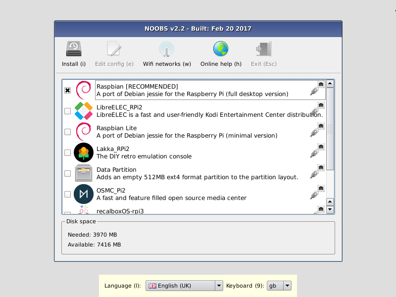

# NOOBS

**New Out Of Box Software (NOOBS)** 是一个简单的树莓派操作系统安装管理器.

## 如何获取NOOBS

### 购买预装的SD卡

我们的许多分销商和独立零售商都提供预装NOOBS的SD卡，包括[Pimoroni](https://shop.pimoroni.com/products/noobs-8gb-sd-card)，
[Adafruit](https:// www.adafruit.com/products/1583) 和 [Pi Hut](http://thepihut.com/collections/raspberry-pi-sd-cards-and-adapters/products/noobs-preinstalled-sd-card)。

### 下载

或者，可以在树莓派官网上下载NOOBS：[raspberrypi.org/downloads](https://www.raspberrypi.org/downloads/)

#### 如何在SD卡上安装NOOBS

下载NOOBS zip文件后，您需要将内容复制到计算机上格式化的SD卡中。

使用空白SD卡设置NOOBS：

- 格式化8GB或更大的SD卡为FAT格式。请参阅下面的说明。
- 下载NOOBS压缩包并解压文件。
- 将提取的文件复制到刚刚格式化的SD卡上，以便该文件位于SD卡的根目录下。请注意，在某些情况下，它可能会将文件解压缩到一个文件夹中;如果是这种情况，那么请从文件夹内部而不是文件夹本身复制文件。
- 首次启动时，“RECOVERY”FAT分区将自动调整为最小值，并显示可安装的操作系统列表。

#### 如何格式化SD卡为FAT格式

**注：** 如果你要格式化容量超过32GB（及64GB及以上）的SD（或micro SD）卡，请参阅单独的[SDXC格式化](sdxc_formatting.md)说明。

##### Windows

如果您是Windows用户，我们建议您使用SD Association的格式化工具格式化SD卡，该工具可从[sdcard.org](https://www.sdcard.org/downloads/formatter_4/)下载。有关使用该工具的说明，请访问同一网站。

##### Mac OS

虽然默认的OS X磁盘工具也能够格式化整个磁盘，但[SD Association格式化工具](https://www.sdcard.org/downloads/formatter_4/)也可供Mac用户使用。为此，请选择SD卡卷并选择“删除”以“MS-DOS”格式。

##### Linux

对于Linux用户，我们建议使用`gparted`（或命令行版本`parted`）。 Norman Dunbar为Linux用户编写了[说明](http://qdosmsq.dunbar-it.co.uk/blog/2013/06/noobs-for-raspberry-pi/)。

## NOOBS中包含哪些内容

以下操作系统目前包含在NOOBS中：

- [Raspbian](http://raspbian.org/)
- [LibreELEC](https://libreelec.tv/)
- [OSMC](https://osmc.tv/)
- [Recalbox](https://www.recalbox.com/)
- [Lakka](http://www.lakka.tv/)
- [RISC OS](https://www.riscosopen.org/wiki/documentation/show/Welcome%20to%20RISC%20OS%20Pi)
- [Screenly OSE](https://www.screenly.io/ose/)
- [Windows 10 IoT Core](https://developer.microsoft.com/en-us/windows/iot)
- [TLXOS](https://thinlinx.com/)

截至NOOBS v1.3.10（2014年9月），NOOBS默认只安装Raspbian，其他可以通过网络连接安装。

## NOOBS和NOOBS Lite

NOOBS有两种形式：离线和网络安装，或仅网络安装。

完整版包含Raspbian，因此可以在离线时从SD卡安装，而使用NOOBS Lite或安装任何其他操作系统需要互联网连接。

请注意，如果发布了新版本的操作系统，则完整版本上的操作系统映像可能已过时，但如果连接到Internet，则会显示下载最新版本的选项（如果有更新版本可用）。

## NOOBS开发

### 最新的NOOBS发布

最新的NOOBS发布是**v3.0.0**，于2018年11月16日发布。
（从NOOBS v1.4.0开始，NOOBS Lite仅共享版本号的前两位数字，即v1.4）

### NOOBS文档

更多全面的文档，包括更高级的NOOBS配置，可以在[GitHub](https://github.com/raspberrypi/noobs/blob/master/README.md)上找到。

### NOOBS源代码

请参阅[GitHub](https://github.com/raspberrypi/noobs)上的NOOBS源代码。
