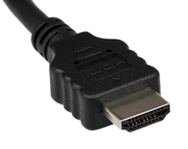
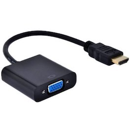
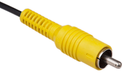

# 监控连接

对于常规使用，你需要将树莓派插入显示设备：显示器或电视。

## HDMI端口

树莓派具有HDMI端口，你可以使用HDMI线直接连接到显示器或电视。这是最简单的解决方案;一些现代显示器和电视有HDMI端口，有些没有，但还有其他选择。

### DVI

对于带DVI端口的显示器，您可以使用HDMI转DVI电缆或带DVI适配器的HDMI电缆。请注意，DVI标准不支持音频。

   

### VGA

对于仅带VGA的显示器，您可以使用HDMI-to-VGA适配器。请注意，VGA不支持音频。

   

## 复合端口

所有型号的Raspberry Pi都有一个用于连接模拟设备的复合输出端口，但连接器的类型因型号而异。最初的Raspberry Pi使用RCA连接器，标准的RCA复合视频引线可以工作。其他型号（Raspberry Pi B +及更高版本）将音频输出和复合输出组合到同一个3.5mm插头上。这需要特定类型的引线，音频留在尖端，音频在环1上，在环2上接地，以及在套管上显示视频。这与Zune和Apple设备上使用的引线相同。

   

有关连接监视器的更多信息，请参阅我们的[学习资源部分](https://www.raspberrypi.org/learning/hardware-guide/equipment/)。
